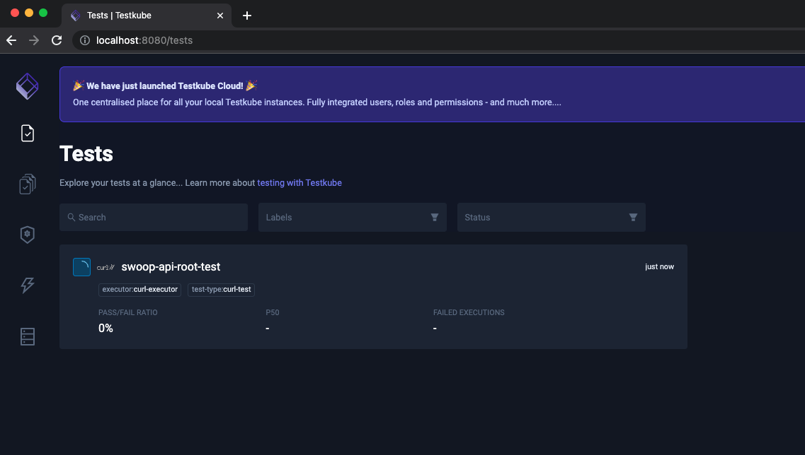

# SWOOP Testkube

This repository contains a list of [STAC Workflow Open Orchestration Platform (SWOOP)](https://github.com/Element84/swoop) test templates to use with Testkube.
<br></br>

## Running Testkube locally
Refer to the official [Testkube Getting Started](https://docs.testkube.io/articles/getting-started-overview) documentation for up-to date instructions.
<br></br>
### Installing the Testkube CLI
On MacOS you can install testkube from Homebrew by running:
```
brew install testkube
```

For other systems, check [Installing Testkube CLI Official Docs](https://docs.testkube.io/articles/step1-installing-cli).
<br></br>
### Installing the Testkube Kubernetes Service and Pods via Helm
To install Testkube on your kubernetes environment via Helm run:

```
helm repo add kubeshop https://kubeshop.github.io/helm-charts ; helm repo update && helm upgrade --install --reuse-values --create-namespace testkube kubeshop/testkube --namespace testkube
```

And wait for pods to be ready with:
```
kubectl wait --for=condition=ready --timeout=30m pod -n testkube -l app.kubernetes.io/instance=testkube
```
<br></br>
### Access the Testkube Dashboard locally
You will first need to port forward the testkube-dashboard to port 8080 and testkube-api-server to port 8088

```
kubectl port-forward svc/testkube-dashboard 8080 -n testkube &
kubectl port-forward svc/testkube-api-server 8088 -n testkube &
```

Then specify the testkube api endpoint by:
```
testkube config api-uri http://127.0.0.1:8088/v1
```

Then you should be able to access the Testkube Dashboard by going on your browser to: [http://localhost:8080/apiEndpoint?apiEndpoint=localhost:8088/v1](http://localhost:8080/apiEndpoint?apiEndpoint=localhost:8088/v1)

<br></br>
<p align="center">
  
</p>
<br></br>

### Running Testkube test templates on your local testkube
First you will need to stand up swoop on your local environment. The quickest way to do that is cloning the FilmDrop Terraform K8s repo: [https://github.com/Element84/filmdrop-k8s-tf-modules](https://github.com/Element84/filmdrop-k8s-tf-modules) and then execute:
```
terraform init
terraform plan -var-file=local.tfvars
terraform apply -var-file=local.tfvars
```


Wait for the swoop api pod to be up via:
```
kubectl wait --for=condition=ready --timeout=30m pod -n swoop -l app=swoop-api
```

Then you can create your first testkube test, which will hit the root of swoop-api by running:
```
testkube create test --namespace testkube --name swoop-api-root-test --type curl/test --test-content-type git-file --git-uri https://github.com/Element84/swoop-testkube.git --git-branch main --git-path tests/curl/swoop-api-root-test.json --variable apiHost=swoop-api.swoop:8000
```

Then run your testkube test by running:
```
testkube run test --watch swoop-api-root-test
```

You should see the test running on your terminal, but you should also see it running on the testkube dashboard via [http://localhost:8080/tests](http://localhost:8080/tests)
<br></br>
<p align="center">
  
</p>
<br></br>


### Running on Testkube Cloud

You're also able to centralize the tests from all your environments by running in Testkube Cloud: [https://cloud.testkube.io/](https://cloud.testkube.io/)

To do so, you will need to install a helm agent pointing to your organization project on Testkube cloud
```
helm repo add kubeshop https://kubeshop.github.io/helm-charts ; helm repo update && helm upgrade --install --reuse-values --create-namespace testkube kubeshop/testkube --set testkube-api.cloud.key=<REPLACE_WITH_TESTKUBE_CLOUD_KEY> --set testkube-api.cloud.orgId=<REPLACE_WITH_TESTKUBE_ORG_ID> --set testkube-api.cloud.envId=<REPLACE_WITH_TESTKUBE_ENV_ID> --set testkube-api.minio.enabled=false --set mongodb.enabled=false --set testkube-dashboard.enabled=false --set testkube-api.cloud.url=agent.testkube.io:443 --namespace testkube
```

You can retrieve the testkube key and id parameters, as well as more up to-date information in [Testkube Agent Install Official documentation](https://docs.testkube.io/articles/step2-installing-cluster-components).
